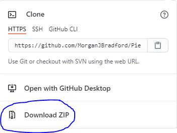

## <div align="center">Animal Shelter API</div>
#### <div align="center"> *An API created for a fictitious animal shelter* </div> 
***<p align="right">Morgan Bradford***</p>   
<p align="center">
<br>


</p>

___
## 🚩 *Description*:    
### *An api for a fictitious animal shelter. Use this api to get, add, edit, and/or remove animals from the shelter's database*


## 🔧 *Setup/Installation instructions:*
#### 🌐 From the web:
* Go to my GitHub repository, using following [URL](https://github.com/MorganJBradford/AnimalShelterApi.Solution.git).
* Click the "Code"  and click the 'Download zip' option .
#### ⚙️ From the terminal: 
* Clone my repository from GitHub using `git clone https://github.com/MorganJBradford/AnimalShelterApi.Solution.git` in your terminal or GitBash
* Navigate to the downloaded folder using the '*cd*' command
⚠️ *Note: To run this project locally you will need to have .NET Core. You can check if you have .NET Core by running 'dotnet --version' in the command line. If you do not have .NET Core please find more information and download [here](https://dotnet.microsoft.com/download/dotnet)*


####  🖥️ View website:

1. Configure appsettings.json.

* Rename the file "EDITME-appsettings.json" to "appsettings.json"
**Uploading to your own repository**: If using vscode and "appsettings.json" is not grayed out like in the image below, you may need to commit the .gitignore file included in this project first. If "appsettings.json" is not grayed out **do not upload your project**


* Navigate to your appsettings.json. The code should appear like the following:

```
{
  "Logging": {
    "LogLevel": {
      "Default": "Warning",
      "System": "Information",
      "Microsoft": "Information"
    }
  },
  "AllowedHosts": "*",
  "ConnectionStrings": {
    "DefaultConnection": "Server=localhost;Port=3306;database=[your_database_name]=root;pwd=[your_database_password];"
  }
}
```

If you are using a server other than the default server, you will need to change the Port number. Otherwise, we will update the code to put in our database information and password. Replace "\[database_name]" with the "animal_shelter_api" and "\[password]" with your password. **Again this is private and should be included in a .gitignore.** The final result should be similar to the following:

```
{
  "Logging": {
    "LogLevel": {
      "Default": "Warning",
      "System": "Information",
      "Microsoft": "Information"
    }
  },
  "AllowedHosts": "*",
  "ConnectionStrings": {
    "DefaultConnection": "Server=localhost;Port=3306;database=animal_shelter_api=root;pwd=password;"
  }
}
```

2. Launch the API

* From the top level directory enter 'cd AnimalShelter' in the command line.
* Run 'dotnet ef database update' to create your database.
* Run the command 'dotnet restore' to download dependencies required to run the project.
* Next, enter 'dotnet run' the in command line. You should see a message similar to the following populate in your terminal:

> Hosting environment: Production
> Content root path: C:\Users\vampi\OneDrive\Desktop\epicodus\AnimalShelterApi.Solution\AnimalShelterApi
> Now listening on: http://localhost:5000
> Now listening on: https://localhost:5001
> Application started. Press Ctrl+C to shut down.

## 📡 API Documentation
API endpoints can be explored via [Postman](https://www.postman.com/downloads/) or in the browser.

### Swagger (Swashbuckle)
For endpoint exploration in browser with swagger, visit 'http://localhost:5000/swagger' after launching the API.

### Endpoints
Base URL: `https://localhost:5000`

#### HTTP Request Structure
```
GET /api/animals
POST /api/animals
GET /api/animals/{id}
PUT /api/animals/{id}
DELETE /api/animals/{id}
```

##### Example Query
```
http://localhost:5000/api/Animals/5
```

#### Example JSON Response
```
{
  "animalId": 5,
  "name": "Gizmo",
  "species": "Cat",
  "age": 7,
  "gender": "F"
}
```

### Animals
Access information on a fake animal shelters unfortunately fake animals.

#### HTTP Request
```
GET /api/{component}
POST /api/{component}
GET /api/{component}/{id}
PUT /api/{component}/{id}
DELETE /api/{component}/{id}
```

#### Path Parameters
| Parameter | Type | Default | Required | Description |
| :---: | :---: | :---: | :---: | --- |
| name | string | none | POST/PUT | Return matches by name.
| species | string | none | POST/PUT | Return animals by species. |
| gender | string | none | false | Return animals by gender |
| age | int | 0 | false | Return animals by age |

#### Example Query
'''
http://localhost:5000/api/animals?species=dog
'''

## 🛠️ *Technologies used:*
* ASP.NET Core MVC
* C# 9
* Entity Framework Core
* Git and GitHub
* Identity
* MSTest
* MySql
* .NET v5.0
* REPL
* Swashbuckle/Swagger

## 🐛 *Known bugs:*
* You you find any bugs, _please_ contact me via my email below.

## 📬 Contact Information
#### For any questions *[email Morgan](mailto:morganjbradford95@gmail.com)*


## 📘 *License and copyright:*

> ***© Morgan Bradford 2021***  
> ⚖️ *[](https://opensource.org/licenses/MIT)*